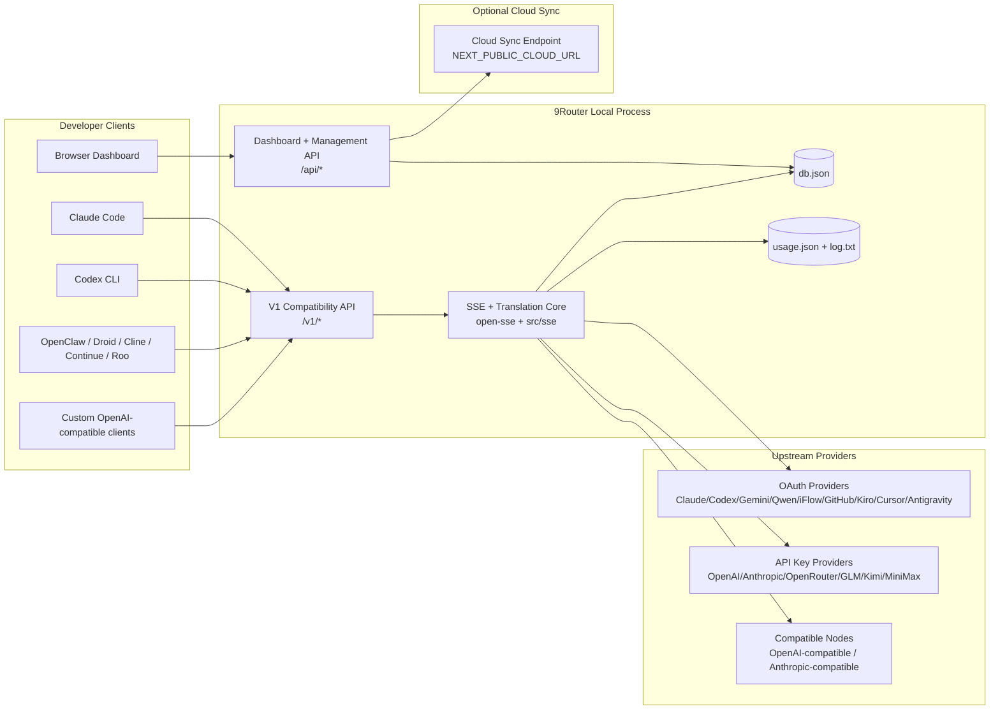
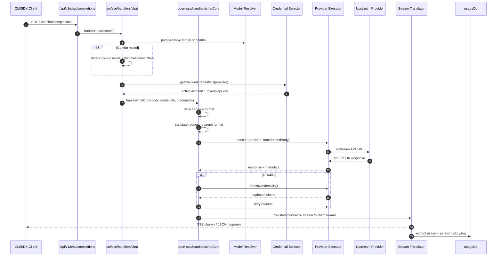
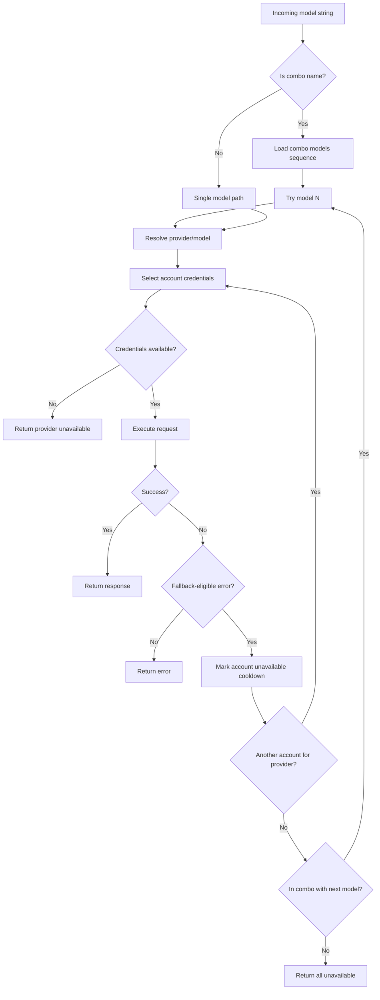
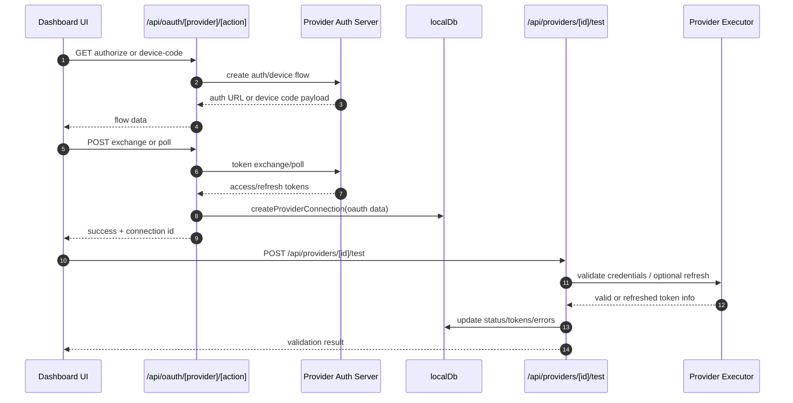
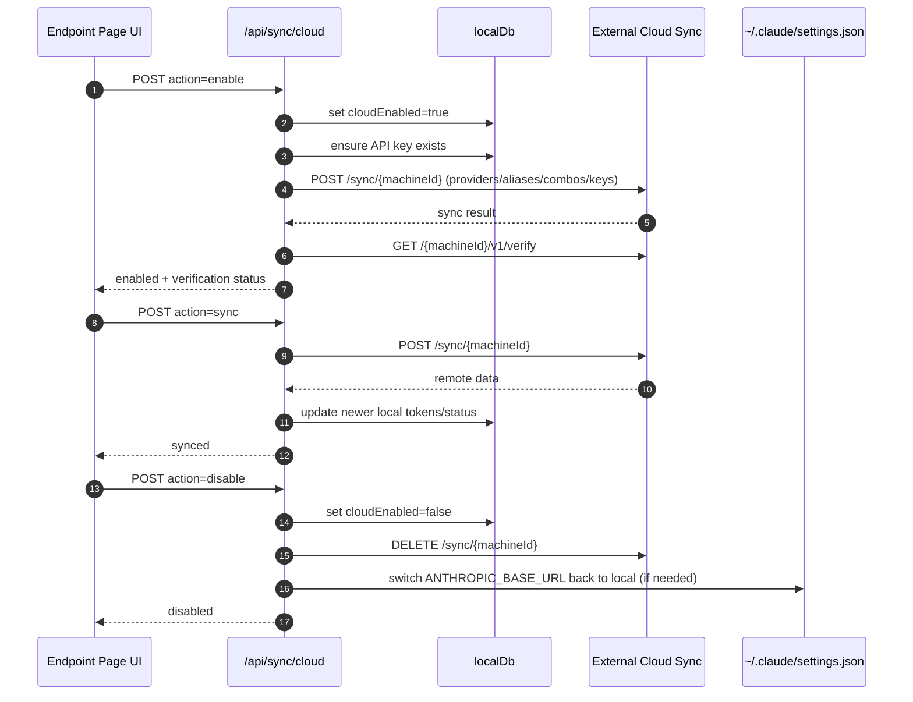
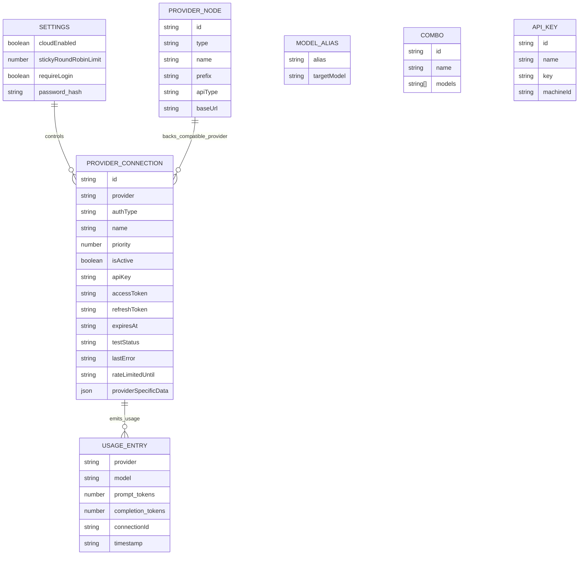
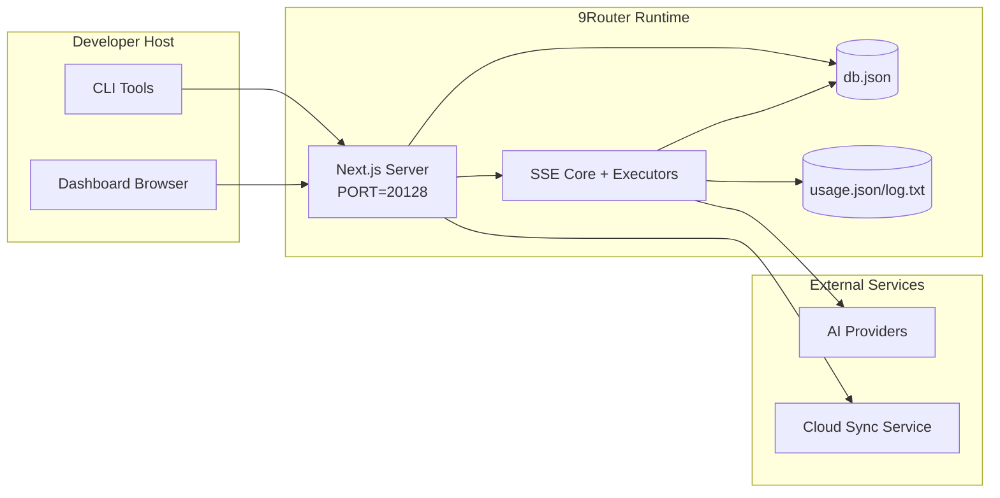

# 9Router Architecture

_Last updated: 2026-02-06_

## Executive Summary

9Router is a local AI routing gateway and dashboard built on Next.js.
It provides a single OpenAI-compatible endpoint (`/v1/*`) and routes traffic across multiple upstream providers with translation, fallback, token refresh, and usage tracking.

Core capabilities:

- OpenAI-compatible API surface for CLI/tools
- Request/response translation across provider formats
- Model combo fallback (multi-model sequence)
- Account-level fallback (multi-account per provider)
- OAuth + API-key provider connection management
- Local persistence for providers, keys, aliases, combos, settings, pricing
- Usage/cost tracking and request logging
- Optional cloud sync for multi-device/state sync

Primary runtime model:

- Next.js app routes under `src/app/api/*` implement both dashboard APIs and compatibility APIs
- A shared SSE/routing core in `src/sse/*` + `open-sse/*` handles provider execution, translation, streaming, fallback, and usage

## Scope and Boundaries

### In Scope

- Local gateway runtime
- Dashboard management APIs
- Provider authentication and token refresh
- Request translation and SSE streaming
- Local state + usage persistence
- Optional cloud sync orchestration

### Out of Scope

- Cloud service implementation behind `NEXT_PUBLIC_CLOUD_URL`
- Provider SLA/control plane outside local process
- External CLI binaries themselves (Claude CLI, Codex CLI, etc.)

## High-Level System Context

## Core Runtime Components

## 1) API and Routing Layer (Next.js App Routes)

Main directories:

- `src/app/api/v1/*` and `src/app/api/v1beta/*` for compatibility APIs
- `src/app/api/*` for management/configuration APIs
- Next rewrites in `next.config.mjs` map `/v1/*` to `/api/v1/*`

Important compatibility routes:

- `src/app/api/v1/chat/completions/route.js`
- `src/app/api/v1/messages/route.js`
- `src/app/api/v1/responses/route.js`
- `src/app/api/v1/models/route.js`
- `src/app/api/v1/messages/count_tokens/route.js`
- `src/app/api/v1beta/models/route.js`
- `src/app/api/v1beta/models/[...path]/route.js`

Management domains:

- Auth/settings: `src/app/api/auth/*`, `src/app/api/settings/*`
- Providers/connections: `src/app/api/providers*`
- Provider nodes: `src/app/api/provider-nodes*`
- OAuth: `src/app/api/oauth/*`
- Keys/aliases/combos/pricing: `src/app/api/keys*`, `src/app/api/models/alias`, `src/app/api/combos*`, `src/app/api/pricing`
- Usage: `src/app/api/usage/*`
- Sync/cloud: `src/app/api/sync/*`, `src/app/api/cloud/*`
- CLI tooling helpers: `src/app/api/cli-tools/*`

## 2) SSE + Translation Core

Main flow modules:

- Entry: `src/sse/handlers/chat.js`
- Core orchestration: `open-sse/handlers/chatCore.js`
- Provider execution adapters: `open-sse/executors/*`
- Format detection/provider config: `open-sse/services/provider.js`
- Model parse/resolve: `src/sse/services/model.js`, `open-sse/services/model.js`
- Account fallback logic: `open-sse/services/accountFallback.js`
- Translation registry: `open-sse/translator/index.js`
- Stream transformations: `open-sse/utils/stream.js`, `open-sse/utils/streamHandler.js`
- Usage extraction/normalization: `open-sse/utils/usageTracking.js`

## 3) Persistence Layer

Primary state DB:

- `src/lib/localDb.js`
- file: `${DATA_DIR}/db.json` (or `~/.9router/db.json` when `DATA_DIR` is unset)
- entities: providerConnections, providerNodes, modelAliases, combos, apiKeys, settings, pricing

Usage DB:

- `src/lib/usageDb.js`
- files: `~/.9router/usage.json`, `~/.9router/log.txt`
- note: currently independent from `DATA_DIR`

## 4) Auth + Security Surfaces

- Dashboard cookie auth: `src/proxy.js`, `src/app/api/auth/login/route.js`
- API key generation/verification: `src/shared/utils/apiKey.js`
- Provider secrets persisted in `providerConnections` entries
- Optional proxy support for upstream calls via env proxy variables (`open-sse/utils/proxyFetch.js`)

## 5) Cloud Sync

- Scheduler init: `src/lib/initCloudSync.js`, `src/shared/services/initializeCloudSync.js`
- Periodic task: `src/shared/services/cloudSyncScheduler.js`
- Control route: `src/app/api/sync/cloud/route.js`

## Request Lifecycle (`/v1/chat/completions`)

## Combo + Account Fallback Flow

Fallback decisions are driven by `open-sse/services/accountFallback.js` using status codes and error-message heuristics.

## OAuth Onboarding and Token Refresh Lifecycle

Refresh during live traffic is executed inside `open-sse/handlers/chatCore.js` via executor `refreshCredentials()`.

## Cloud Sync Lifecycle (Enable / Sync / Disable)

Periodic sync is triggered by `CloudSyncScheduler` when cloud is enabled.

## Data Model and Storage Map

Physical storage files:

- main state: `${DATA_DIR}/db.json` (or `~/.9router/db.json`)
- usage stats: `~/.9router/usage.json`
- request log lines: `~/.9router/log.txt`
- optional translator/request debug sessions: `<repo>/logs/...`

## Deployment Topology

## Module Mapping (Decision-Critical)

### Route and API Modules

- `src/app/api/v1/*`, `src/app/api/v1beta/*`: compatibility APIs
- `src/app/api/providers*`: provider CRUD, validation, testing
- `src/app/api/provider-nodes*`: custom compatible node management
- `src/app/api/oauth/*`: OAuth/device-code flows
- `src/app/api/keys*`: local API key lifecycle
- `src/app/api/models/alias`: alias management
- `src/app/api/combos*`: fallback combo management
- `src/app/api/pricing`: pricing overrides for cost calculation
- `src/app/api/usage/*`: usage and logs APIs
- `src/app/api/sync/*` + `src/app/api/cloud/*`: cloud sync and cloud-facing helpers
- `src/app/api/cli-tools/*`: local CLI config writers/checkers

### Routing and Execution Core

- `src/sse/handlers/chat.js`: request parse, combo handling, account selection loop
- `open-sse/handlers/chatCore.js`: translation, executor dispatch, retry/refresh handling, stream setup
- `open-sse/executors/*`: provider-specific network and format behavior

### Translation Registry and Format Converters

- `open-sse/translator/index.js`: translator registry and orchestration
- Request translators: `open-sse/translator/request/*`
- Response translators: `open-sse/translator/response/*`
- Format constants: `open-sse/translator/formats.js`

### Persistence

- `src/lib/localDb.js`: persistent config/state
- `src/lib/usageDb.js`: usage history and rolling request logs

## Provider Executor Coverage

Specialized executors:

- `antigravity`
- `gemini-cli`
- `github`
- `kiro`
- `codex`
- `cursor`

Default executor path:

- all other providers (including compatible node providers) use `open-sse/executors/default.js`

## Format Translation Coverage

Detected source formats include:

- `openai`
- `openai-responses`
- `claude`
- `gemini`

Target formats include:

- OpenAI chat/Responses
- Claude
- Gemini/Gemini-CLI/Antigravity envelope
- Kiro
- Cursor

Translations are selected dynamically based on source payload shape and provider target format.

## Failure Modes and Resilience

## 1) Account/Provider Availability

- provider account cooldown on transient/rate/auth errors
- account fallback before failing request
- combo model fallback when current model/provider path is exhausted

## 2) Token Expiry

- pre-check and refresh with retry for refreshable providers
- 401/403 retry after refresh attempt in core path

## 3) Stream Safety

- disconnect-aware stream controller
- translation stream with end-of-stream flush and `[DONE]` handling
- usage estimation fallback when provider usage metadata is missing

## 4) Cloud Sync Degradation

- sync errors are surfaced but local runtime continues
- scheduler has retry-capable logic, but periodic execution currently calls single-attempt sync by default

## 5) Data Integrity

- DB shape migration/repair for missing keys
- corrupt JSON reset safeguards for localDb and usageDb

## Observability and Operational Signals

Runtime visibility sources:

- console logs from `src/sse/utils/logger.js`
- per-request usage aggregates in `usage.json`
- textual request status log in `log.txt`
- optional deep request/translation logs under `logs/` when `ENABLE_REQUEST_LOGS=true`
- dashboard usage endpoints (`/api/usage/*`) for UI consumption

## Security-Sensitive Boundaries

- JWT secret (`JWT_SECRET`) secures dashboard session cookie verification/signing
- Initial password fallback (`INITIAL_PASSWORD`, default `123456`) must be overridden in real deployments
- API key HMAC secret (`API_KEY_SECRET`) secures generated local API key format
- Provider secrets (API keys/tokens) are persisted in local DB and should be protected at filesystem level
- Cloud sync endpoints rely on API key auth + machine id semantics

## Environment and Runtime Matrix

Environment variables actively used by code:

- App/auth: `JWT_SECRET`, `INITIAL_PASSWORD`
- Storage: `DATA_DIR`
- Security hashing: `API_KEY_SECRET`, `MACHINE_ID_SALT`
- Logging: `ENABLE_REQUEST_LOGS`
- Sync/cloud URLing: `NEXT_PUBLIC_BASE_URL`, `NEXT_PUBLIC_CLOUD_URL`
- Outbound proxy: `HTTP_PROXY`, `HTTPS_PROXY`, `ALL_PROXY`, `NO_PROXY` and lowercase variants
- Platform/runtime helpers (not app-specific config): `APPDATA`, `NODE_ENV`, `PORT`, `HOSTNAME`

## Known Architectural Notes

1. `usageDb` currently stores under `~/.9router` and does not follow `DATA_DIR`.
2. `/api/v1/route.js` returns a static model list and is not the main models source used by `/v1/models`.
3. Request logger writes full headers/body when enabled; treat log directory as sensitive.
4. Cloud behavior depends on correct `NEXT_PUBLIC_BASE_URL` and cloud endpoint reachability.

## Operational Verification Checklist

- Build from source: `cd /root/dev/9router && npm run build`
- Build Docker image: `cd /root/dev/9router && docker build -t 9router .`
- Start service and verify:
- `GET /api/settings`
- `GET /api/v1/models`
- CLI target base URL should be `http://<host>:20128/v1` when `PORT=20128`
